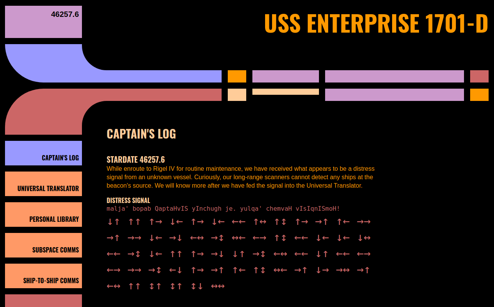

# Picard Geocache

This is a small Gatsby site to share a Star Trek themed puzzle that eventually leads to a geocache.

Check out the [deployed site](https://sfritton.github.io/picard-geocache/).



## Running it locally

```sh
npm install
npm run develop
```

## Dependencies

- [Gatsby](https://www.gatsbyjs.com/)
